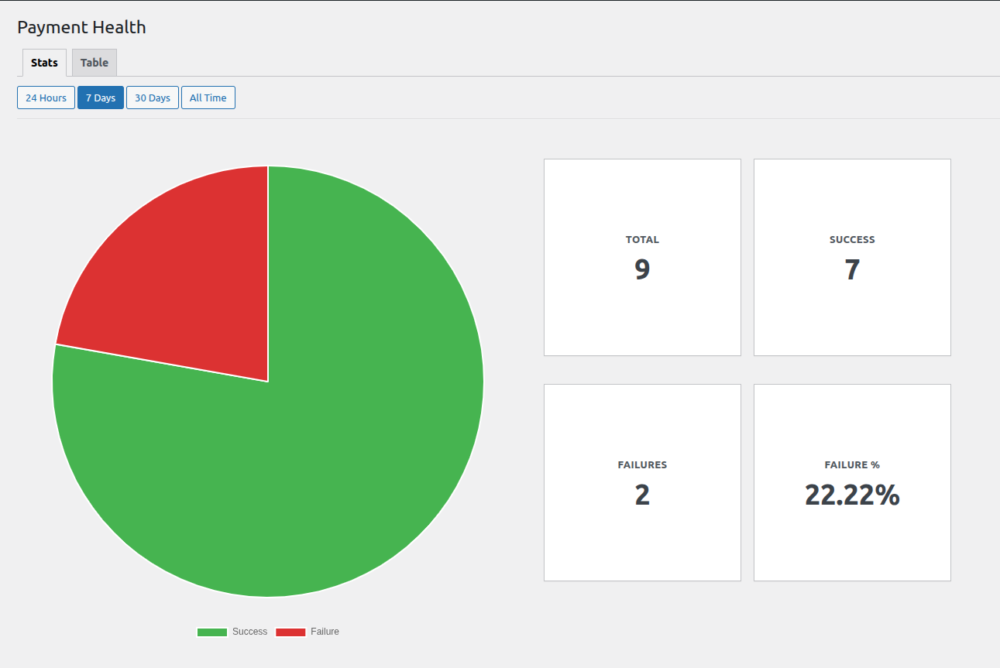
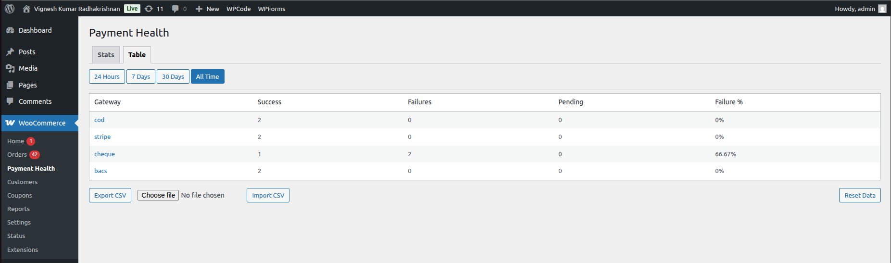

# WC Payment Health

Monitor WooCommerce payment success and failure rates across gateways with CSV import/export support.

---

## Overview

**WC Payment Health** helps store owners monitor the health of their WooCommerce payment gateways by tracking successful and failed payment outcomes.

It records final payment outcomes (success or failure) for both online and offline payment methods and presents a simple admin dashboard showing gateway-level statistics.

This plugin is designed as a lightweight MVP with a focus on clarity, correctness, and minimal performance impact.

---

## Features

- Tracks successful and failed payments per gateway
- Supports online and offline payment methods
- Final-outcome based tracking (no noisy intermediate states)
- Admin dashboard with gateway-level statistics
- CSV export and import
- Safe, bounded storage using WordPress options
- No external services or tracking

---

## What This Plugin Does NOT Do

- Does not replace payment gateways
- Does not intercept payment processing
- Does not track customer or personal data
- Does not modify WooCommerce orders

---

## Screenshots

## Installation

1. Clone or download the repository.
2. Copy the `wc-payment-health` folder into `wp-content/plugins/`.
3. Activate the plugin from **Plugins → Installed Plugins**.
4. Navigate to **WooCommerce → Payment Health**.

---

## Status

**MVP (v0.1.0)**  
Actively evolving.

---

## License

GPLv2 or later  
© 2025
